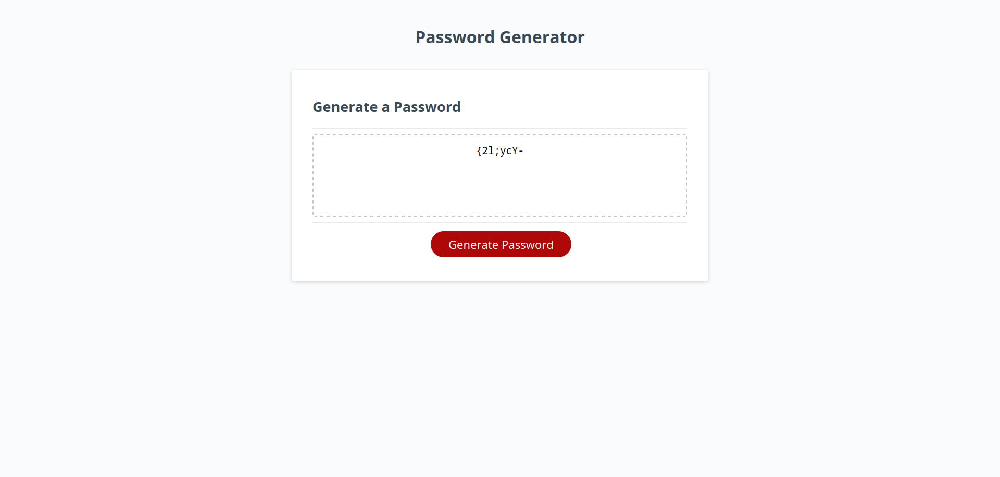

# <Password-Generator>

## Description

The purpose of this project was to create a password generator that would prompt the user for multiple character types to use. Upon clicking on the generate button, the users password would show. I learned how to do this in a variety of ways, through class and the tutoring session. As well as doing outside research to assist me into thinking of different routes of approach.

## Installation

In order to access the website click on the link: https://alexdcp.github.io/Password-Generator/

## Usage

Once you access the website, you must navigate through the prompts and click "generate" in order to create the password according to selections made. Once you have done so, the site should look something like:

To add a screenshot, create an `assets/images` folder in your repository and upload your screenshot to it. Then, using the relative filepath, add it to your README using the following syntax:

    
    
    

## Credits

I received help from my tutor, Jaytee Padilla who I unfortunately do not have a link to his grubhub. I also received help from multiple stack overflow threads and MDN.